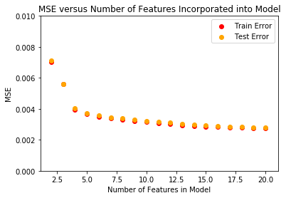

# Feature Selection - simplistic greedy approach
As we've now seen, it's fairly easy to overfit a model and as such we may need to make decisions about what variables or factors to include in the model and which to leave out. A simplistic way to do this is to add features individually, one by one.

## 1. Split the data into a test and train set.


```python
import pandas as pd
import numpy as np
df = pd.read_csv('Swiss_Healthcare_Premium_Prediction.csv.gz', compression='gzip')

df = df.fillna(value=0)
X = df[df.columns[:-1]]
y = df['Premium']
print(len(df))
df.head()
```

    53617


<div>
<style scoped>
    .dataframe tbody tr th:only-of-type {
        vertical-align: middle;
    }

    .dataframe tbody tr th {
        vertical-align: top;
    }

    .dataframe thead th {
        text-align: right;
    }
</style>
<table border="1" class="dataframe">
  <thead>
    <tr style="text-align: right;">
      <th></th>
      <th>Unnamed: 0</th>
      <th>ID</th>
      <th>CAT_Insurer</th>
      <th>CAT_Region_Num</th>
      <th>205d_V2_CUR</th>
      <th>205d_V3_PRC</th>
      <th>212d_V1_CUR</th>
      <th>212d_V2_PRC</th>
      <th>213d_V2_CUR</th>
      <th>213d_V3_PRC</th>
      <th>...</th>
      <th>KG_SPS_226d_V1_CUR</th>
      <th>KG_SPS_227d_V1_PRC</th>
      <th>KG_SPS_229d_V1_CUR</th>
      <th>KG_SX_226d_V1_CUR</th>
      <th>KG_SX_227d_V1_PRC</th>
      <th>KG_SX_229d_V1_CUR</th>
      <th>KG_TOT_226d_V1_CUR</th>
      <th>KG_TOT_227d_V1_PRC</th>
      <th>KG_TOT_229d_V1_CUR</th>
      <th>Premium</th>
    </tr>
  </thead>
  <tbody>
    <tr>
      <th>0</th>
      <td>0</td>
      <td>0.000000</td>
      <td>0.0</td>
      <td>0.0</td>
      <td>0.326051</td>
      <td>0.215957</td>
      <td>0.322181</td>
      <td>0.234051</td>
      <td>0.377469</td>
      <td>0.213745</td>
      <td>...</td>
      <td>0.275441</td>
      <td>0.373868</td>
      <td>0.285167</td>
      <td>0.149472</td>
      <td>0.610291</td>
      <td>0.131174</td>
      <td>0.326051</td>
      <td>0.215957</td>
      <td>0.359147</td>
      <td>0.409432</td>
    </tr>
    <tr>
      <th>1</th>
      <td>1</td>
      <td>0.000019</td>
      <td>0.0</td>
      <td>0.0</td>
      <td>0.326051</td>
      <td>0.215957</td>
      <td>0.322181</td>
      <td>0.234051</td>
      <td>0.377469</td>
      <td>0.213745</td>
      <td>...</td>
      <td>0.275441</td>
      <td>0.373868</td>
      <td>0.285167</td>
      <td>0.149472</td>
      <td>0.610291</td>
      <td>0.131174</td>
      <td>0.326051</td>
      <td>0.215957</td>
      <td>0.359147</td>
      <td>0.394941</td>
    </tr>
    <tr>
      <th>2</th>
      <td>2</td>
      <td>0.000037</td>
      <td>0.0</td>
      <td>0.0</td>
      <td>0.326051</td>
      <td>0.215957</td>
      <td>0.322181</td>
      <td>0.234051</td>
      <td>0.377469</td>
      <td>0.213745</td>
      <td>...</td>
      <td>0.275441</td>
      <td>0.373868</td>
      <td>0.285167</td>
      <td>0.149472</td>
      <td>0.610291</td>
      <td>0.131174</td>
      <td>0.326051</td>
      <td>0.215957</td>
      <td>0.359147</td>
      <td>0.358463</td>
    </tr>
    <tr>
      <th>3</th>
      <td>3</td>
      <td>0.000056</td>
      <td>0.0</td>
      <td>0.0</td>
      <td>0.326051</td>
      <td>0.215957</td>
      <td>0.322181</td>
      <td>0.234051</td>
      <td>0.377469</td>
      <td>0.213745</td>
      <td>...</td>
      <td>0.275441</td>
      <td>0.373868</td>
      <td>0.285167</td>
      <td>0.149472</td>
      <td>0.610291</td>
      <td>0.131174</td>
      <td>0.326051</td>
      <td>0.215957</td>
      <td>0.359147</td>
      <td>0.321986</td>
    </tr>
    <tr>
      <th>4</th>
      <td>4</td>
      <td>0.000075</td>
      <td>0.0</td>
      <td>0.0</td>
      <td>0.326051</td>
      <td>0.215957</td>
      <td>0.322181</td>
      <td>0.234051</td>
      <td>0.377469</td>
      <td>0.213745</td>
      <td>...</td>
      <td>0.275441</td>
      <td>0.373868</td>
      <td>0.285167</td>
      <td>0.149472</td>
      <td>0.610291</td>
      <td>0.131174</td>
      <td>0.326051</td>
      <td>0.215957</td>
      <td>0.359147</td>
      <td>0.285634</td>
    </tr>
  </tbody>
</table>
<p>5 rows × 196 columns</p>
</div>


```python
#Your code here
from sklearn.model_selection import train_test_split
X_train , X_test, y_train, y_test = train_test_split(X, y)
```

## 2. Find the [single] best feature to train a regression model on
Loop through all of the X features and train an unpenalized LinearRegression model using each of those single features. Find the feature that produces the lowest Mean squared test error.


```python
from sklearn.linear_model import LinearRegression
linreg = LinearRegression()
```


```python
#Your code here
from sklearn.linear_model import LinearRegression
min_test_err = 10**100 #Create an incredibly high initialization val
best_feat = None

def mse(residual_col):
    return np.mean(residual_col.astype(float).map(lambda x: x**2))

for feat in X.columns:
    linreg = LinearRegression()
    cur_X_train = np.array(X_train[feat]).reshape(-1, 1)
    cur_X_test = np.array(X_test[feat]).reshape(-1, 1)
    linreg.fit(cur_X_train, y_train)
    y_hat_test = linreg.predict(cur_X_test)
    test_err = mse(y_hat_test-y_test)
#     print(feat, round(test_err,2))
    if  test_err < min_test_err:
        min_test_err = test_err
        best_feat = feat
print('The single best predictor was: {}'.format(feat))
```

    The single best predictor was: KG_TOT_229d_V1_CUR


## 3. Generalize #2
Write a function that takes in a desired number of features and returns a model using the top n features (according to test set error). Be sure to do this iteratively. In other words, rather then simply taking the top n features based on how well each performs individually, first find the best feature and train a model, then loop back through all of the remaining features and select that which produces the best results in combination with the best feature already selected. Continue on finding the best third feature in combination with the previous 2 features, etc. This process will continue until you reach the desired number of features (or there are no features left).


```python
def best_feat(X_train, X_test, y_train, y_test, feat_options, prev_feats=[]):
        min_test_err = 10**100 #Create an incredibly high initialization val
        best_feat = None
        for feat in feat_options:
            linreg = LinearRegression()
            if prev_feats == []:
                cur_X_train = np.array(X_train[feat]).reshape(-1, 1)
                cur_X_test = np.array(X_test[feat]).reshape(-1, 1)
            else:
                feats = prev_feats + [feat]
                cur_X_train = X_train[feats]
                cur_X_test = X_test[feats]
            linreg.fit(cur_X_train, y_train)
            y_hat_test = linreg.predict(cur_X_test)
            test_err = mse(y_hat_test-y_test)
            if  test_err < min_test_err:
                min_test_err = test_err
                best_feat = feat
        return best_feat
```


```python
def linreg_greedy_feat(n_feats, X_train, X_test, y_train, y_test):
    #Your code here
    cur_model_feats = []
    remaining_feats = list(X.columns)
    for n in range(1,n_feats+1):
        next_feat = best_feat(X_train, X_test, y_train, y_test,
                              feat_options=remaining_feats, prev_feats = cur_model_feats)
        cur_model_feats.append(next_feat)
        remaining_feats.remove(next_feat)
    model = LinearRegression()
    model.fit(X_train[cur_model_feats], y_train)
    return model, cur_model_feats
```

# Plotting Learning Curves
Iterate from 2 to 20 feature variables. Use your greedy classifier defined above to generate a linear regression model with successively more and more features incorporated into the model. Then plot the train and test errors as a function of the number of variables incorporated into each of these models.


```python
#***********Warning this block will take several minutes to run************
import datetime
import matplotlib.pyplot as plt
%matplotlib inline

start = datetime.datetime.now()
for i in range(2,21):
    cycle_start = datetime.datetime.now()
    #print('On iteration: {}'.format(i-1))
    #Train Greedy Classifier Model with this many features
    model, cur_model_feats = linreg_greedy_feat(i, X_train, X_test, y_train, y_test)
    model.fit(X_train[cur_model_feats], y_train)
    
    #Calculate Training Mean Squared Error
    y_hat_train = model.predict(X_train[cur_model_feats])
    train_err = mse(y_hat_train-y_train)
    
    #Calculate Test Mean Squared Error
    y_hat_test = model.predict(X_test[cur_model_feats])
    test_err = mse(y_hat_test-y_test)
    
    #Plot Results
    if i ==2:
        plt.scatter(i, train_err, c='red', label='Train Error')
        plt.scatter(i, test_err, c='orange', label='Test Error')
    else:
        plt.scatter(i, train_err, c='red')
        plt.scatter(i, test_err, c='orange')
    end = datetime.datetime.now()
    cycle_time = end - cycle_start
    elapsed = end - start
#     print('Cycle took: {}'.format(cycle_time))
#     print('Total time elapsed: {}'.format(elapsed))

#Add Legend and Descriptive Title/Axis Labels
plt.legend(bbox_to_anchor=(1,1))
plt.ylim(0, 0.01)
plt.ylabel('MSE')
plt.xlabel('Number of Features in Model')
plt.title('MSE versus Number of Features Incorporated into Model')
```


    Text(0.5,1,'MSE versus Number of Features Incorporated into Model')




